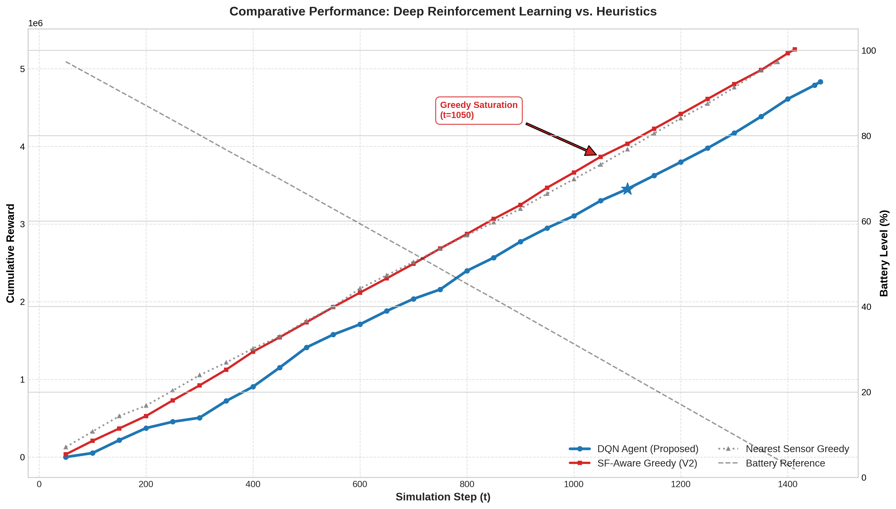

# UAV-IoT Data Collection via Protocol-Aware Deep Reinforcement Learning

## Introduction

This repository contains the simulation framework and trained models for a final-year engineering project (EEEN30330) at the University of Manchester. A Deep Q-Network (DQN) agent learns to navigate a UAV over a 2D grid to collect data from LoRa IoT sensors, optimising jointly for data throughput, energy efficiency, and fairness across sensors.

The key contribution is a Gymnasium-compatible simulation that models the complete causal chain from UAV position through received signal strength (RSSI), EMA-based Adaptive Data Rate (ADR) convergence latency, and the LoRa Capture Effect to packet delivery — all within a single environment step. This end-to-end fidelity enables the DQN agent to learn to exploit protocol-level dynamics (e.g., repositioning to accelerate ADR convergence to lower Spreading Factors) in ways that simple greedy heuristics cannot.

---

## Contextual Overview

Representative DQN and Relational-RL trajectories alongside greedy / TSP / lawnmower baselines are produced by `compare_agents.py`; see `src/agents/dqn/dqn_evaluation_results/baseline_results/` (e.g., `agent_trajectories.png`, `final_comparison_graph.png`) after running the evaluation scripts below.

The system architecture is as follows:

```
┌──────────────────────────────────────────────────────────────┐
│                      DQN Agent (SB3)                         │
│               MLP Policy [512, 512, 256]                     │
│   Domain Randomisation · Curriculum Learning · 4× DummyVecEnv│
└──────────────────────────┬───────────────────────────────────┘
                           │  action: {0=N, 1=S, 2=E, 3=W, 4=Hover}
                           ▼
┌──────────────────────────────────────────────────────────────┐
│            Gymnasium Environment  (uav_env.py)               │
│  ┌─────────────────┐  ┌──────────────────┐  ┌────────────┐  │
│  │  UAV (uav.py)   │  │ IoTSensor        │  │  Reward    │  │
│  │  274 Wh battery │  │ (iot_sensors.py) │  │  Function  │  │
│  │  100 m altitude │  │ SF7–SF12, EMA-ADR│  │            │  │
│  │  10 m/s speed   │  │ Capture Effect   │  │            │  │
│  └─────────────────┘  └──────────────────┘  └────────────┘  │
│   Two-Ray Ground Reflection · N(0,4dB) Shadowing · 2100 steps│
└──────────────────────────┬───────────────────────────────────┘
                           │  observation, reward, done
                           ▼
         Multi-seed evaluation vs. NearestSensor & MaxThroughput baselines
```

A position-occupancy diagnostic (`boundary_diagnostic.py`, `boundary_diagnostic_relational.py`) writes per-episode JSON to `baseline_results/` and quantifies the flat-MLP DQN's perimeter-adjacent flight behaviour (100% edge occupancy on 20 seeds) alongside the Relational RL policy (21.5% edge occupancy, 0 wall collisions).

### Repository Structure

```
project/
├── src/
│   ├── environment/
│   │   ├── uav_env.py              # Gymnasium environment (grid, actions, rendering)
│   │   ├── iot_sensors.py          # LoRa sensor physics (path loss, ADR, buffers)
│   │   └── uav.py                  # UAV position and battery model
│   ├── rewards/
│   │   └── reward_function.py      # Multi-objective reward (data, fairness, energy)
│   ├── diagrams/
│   │   ├── environment/            # three_dimensional.py — Two-Ray model visualisation
│   │   ├── q_learning/             # DQN system context, component, container, code diagrams
│   │   ├── ppo_learning/           # DQN training pipeline and evaluation diagrams
│   │   └── greedy/                 # MaxThroughputGreedy flowchart
│   └── agents/dqn/
│       ├── dqn.py                  # Main training (domain randomisation + curriculum)
│       ├── evaluate_dqn.py         # Single-seed evaluation
│       ├── train_ablation_a4.py    # Ablation A4: fixed env, no domain randomisation
│       └── dqn_evaluation_results/
│           ├── ablation_study.py           # Component ablation (A1–A4)
│           ├── compare_agents.py           # DQN vs greedy baselines
│           ├── fairness_sweep.py           # Multi-condition fairness analysis
│           ├── greedy_agents.py            # NearestSensor + MaxThroughput baselines
│           ├── training_results/           # Training convergence figures
│           ├── trajectory_results/         # Single-episode trajectory figures
│           ├── baseline_results/           # DQN vs baseline comparison figures
│           ├── ablation_results/           # Ablation study figures
│           ├── sweep_fairness_results/     # Jain's fairness sweep figures
│           ├── multi_seed_results/         # Multi-seed evaluation figures
│           ├── hover_analysis/             # Hover behaviour analysis figures
│           └── cross_layout_results/       # Cross-layout generalisation figures
├── models/
│   ├── dqn_domain_rand/
│   │   └── dqn_final.zip           # Trained DQN model (domain-randomised + curriculum)
│   └── dqn_no_dr/                  # Ablation A4 control model (fixed env)
├── MSc_and_BEng_Dissertation_Template_.../
│   └── main.tex                    # Dissertation LaTeX source
└── README.md
```

---

## Installation Instructions

### Required Software

| Requirement | Version |
|---|---|
| Python | 3.11 or higher |
| `uv` package manager | latest (recommended) |
| CUDA-capable GPU | Optional — CPU training is supported but significantly slower |

Install `uv` if not already installed:

```bash
pip install uv
```

### Dependencies

All dependencies are declared in `pyproject.toml`. Key packages:

| Package | Version |
|---|---|
| PyTorch | 2.5.1+cu121 |
| Stable-Baselines3 | latest |
| Gymnasium | latest |
| NumPy | latest |
| Matplotlib | latest |
| Seaborn | latest |
| Pandas | latest |

### Environment Setup

```bash
# 1. Clone the repository
git clone https://github.com/atiladeokegab/-Reinforcement-Learning-for-Dynamic-UAV-Energy-Efficient-Path-Planning-in-IoT-Sensor-Networks.git
cd <repo-directory>

# 2. Install all dependencies with uv (creates a virtual environment automatically)
uv sync

# --- Alternative: install with pip ---
pip install torch==2.5.1+cu121 --index-url https://download.pytorch.org/whl/cu121
pip install stable-baselines3 gymnasium matplotlib seaborn pandas numpy
```

To verify the installation:

```bash
uv run python -c "import stable_baselines3, gymnasium, torch; print('OK')"
```

---

## How to Run the Software

### Train the DQN Agent

```bash
uv run python src/agents/dqn/dqn.py
```

This trains the agent for 2 million timesteps across 4 parallel environments using domain randomisation and a three-stage curriculum (easy → medium → full distribution). The trained model is saved to:

```
models/dqn_domain_rand/dqn_final.zip
```

Expected training time: approximately 4 hours on an RTX 3050 Ti (GPU). CPU training is possible but will take significantly longer.

### Evaluate Against Greedy Baselines

```bash
uv run python src/agents/dqn/dqn_evaluation_results/compare_agents.py
```

Runs the DQN agent, `NearestSensorGreedy`, and `MaxThroughputGreedy` on the same seeded episodes and produces comparison figures in `dqn_evaluation_results/baseline_results/`.

### Run the Ablation Study

```bash
uv run python src/agents/dqn/dqn_evaluation_results/ablation_study.py
```

Evaluates all four ablation variants (A1–A4) against the full DQN. Figures saved to `dqn_evaluation_results/ablation_results/`.

### Run the Fairness Sweep

```bash
uv run python src/agents/dqn/dqn_evaluation_results/fairness_sweep.py
```

Sweeps all 16 training conditions (4 grid sizes × 4 sensor counts) and plots Jain's fairness index. Figures saved to `dqn_evaluation_results/sweep_fairness_results/`.

### Run the Boundary-Occupancy Diagnostics

```bash
uv run python src/agents/dqn/dqn_evaluation_results/boundary_diagnostic.py
uv run python src/agents/dqn/dqn_evaluation_results/boundary_diagnostic_relational.py
```

Runs 20 episodes for each policy, reporting `boundary_hits` (failed moves into the grid edge) and `edge_steps` (steps spent on a boundary-adjacent cell). Per-episode JSON is written to `baseline_results/`. The diagnostic is the empirical basis for the architectural-limit finding discussed in the dissertation.

### Train the Ablation A4 Control Model

```bash
uv run python src/agents/dqn/train_ablation_a4.py
```

Trains a fixed-environment DQN (500×500, N=20, no domain randomisation). Saved to `models/dqn_no_dr/`.

### Reproduce All Results Figures

To reproduce every figure from the dissertation Results chapter in sequence:

```bash
uv run python src/agents/dqn/dqn_evaluation_results/compare_agents.py
uv run python src/agents/dqn/dqn_evaluation_results/fairness_sweep.py
uv run python src/agents/dqn/dqn_evaluation_results/ablation_study.py
```

Fixed random seeds are used throughout: `{42, 123, 256, 789, 1337}` (20 seeds per condition, 30 for N=40).

---

## Technical Details

### Algorithm

The agent is a Deep Q-Network (DQN) implemented via Stable-Baselines3. Key hyperparameters:

| Hyperparameter | Value |
|---|---|
| Policy network | MLP [512, 512, 256] |
| Optimiser | Adam |
| Loss function | Huber (SmoothL1) |
| Discount factor γ | 0.99 |
| Replay buffer size | 100,000 transitions |
| Batch size | 256 |
| Target network update | Soft update (τ = 0.005) |
| Exploration | ε-greedy (ε: 1.0 → 0.05) |
| Parallel environments | 4 (DummyVecEnv) |
| Total timesteps | 2,000,000 |

**Domain randomisation** samples a new `(grid_size, num_sensors)` pair each episode from a 16-condition joint distribution (4 grids × 4 sensor counts). A three-stage **curriculum** unlocks harder conditions progressively:

- Stage 0 (0–150k steps): grids 100–300, N = 10–20
- Stage 1 (150k–400k steps): + grid 500, N = 30
- Stage 2 (400k+ steps): full distribution including 1000×1000, N = 40

Training-convergence curves are written to `baseline_results/training_convergence.png` (DQN) and `baseline_results/relational_convergence.png` (Relational RL) after running the corresponding training scripts.

### Relational RL (Permutation-Invariant Policy)

In addition to the flat-MLP DQN, the repository contains a Relational RL policy trained with PPO via Ray RLlib. The policy treats the sensor field as an unordered set, applies a shared per-sensor encoder, pools to a permutation-invariant representation, and emits discrete actions. Checkpoints are extracted to `src/agents/dqn/models/relational_rl/` (full policy) and `src/agents/dqn/models/relational_rl_ablation/` (ablation — step-penalty, no dwell bonus, N = 20). The Relational RL policy is evaluated alongside the DQN and baselines by `compare_agents.py`; a matched boundary-occupancy diagnostic is provided by `boundary_diagnostic_relational.py`.

### Environment Model

| Parameter | Value |
|---|---|
| Grid size | 100×100 to 1000×1000 cells (10 m/cell) |
| UAV altitude | 100 m (constant) |
| UAV speed | 10 m/s |
| UAV battery | 274 Wh (DJI TB60-inspired) |
| Power — moving | 500 W |
| Power — hovering | 700 W |
| Action space | N, S, E, W, Hover/Collect (5 discrete) |
| Episode length | 2100 timesteps (~7 min flight) |
| Sensors per episode | 10–40 |
| Spreading Factors | SF7–SF12 (EMA-ADR, λ = 0.1) |
| Buffer size per sensor | 1000 bytes |
| Duty cycle | 1% (EU LoRaWAN regulation) |
| Path loss model | Two-Ray Ground Reflection |
| Shadowing | Gaussian N(0, 4 dB) added to RSSI |
| Capture Effect threshold | 6 dB; closest same-SF transmitter wins |

### Reward Function

| Event | Reward |
|---|---|
| Per byte collected | +100 |
| New sensor visited (first time) | +5000 |
| Multi-sensor collection bonus | +200 |
| Urgency (AoI) reduction | +1000 |
| Revisit penalty | −2 |
| Boundary collision | −50 |
| Sensor starvation (neglect) | −500 |
| Unvisited sensor at episode end | −2000 |

### Key Results

The figure below summarises the DQN's performance advantage over both greedy baselines across the key metrics at N = 40 sensors:



| Metric | DQN | MaxThroughputGreedy | Advantage |
|---|---|---|---|
| Cumulative reward | — | — | +8.6% (p = 0.043, Cohen's d = 0.54) |
| Energy efficiency | 259.5 B/Wh | 238.7 B/Wh | +8.7% |
| Jain's Fairness Index | 0.739 | 0.709 | +4.2% |
| Sensor coverage | 100% | 100% | = |

### Ablation Study

Four components were ablated to isolate their contributions:

| Ablation | Component removed | Description |
|---|---|---|
| A1 | Capture Effect | All same-SF simultaneous transmissions → packet loss |
| A2 | EMA-ADR smoothing | λ set to 1.0 (instant ADR, no convergence latency) |
| A3 | AoI observation | Urgency features zeroed — agent cannot see time-since-visit |
| A4 | Domain randomisation | Fixed 500×500, N = 20; separate control model trained |

Ablation comparison bars are written to `baseline_results/ablation_comparison.png` after running `ablation_study.py`.

### Fairness Across Conditions

Jain's fairness index is measured across all 16 training conditions by `fairness_sweep.py`; outputs include a summary matrix in `sweep_fairness_results/` that compares DQN against greedy baselines as grid size and sensor count scale.

### Third-Party Code and Academic Integrity

All third-party libraries are used in accordance with their licences:

| Library | Licence | Use |
|---|---|---|
| Stable-Baselines3 | MIT | DQN agent implementation |
| Gymnasium | MIT | Environment interface |
| PyTorch | BSD-3 | Neural network backend |
| Matplotlib / Seaborn | PSF / BSD | Figures |
| NumPy / Pandas | BSD | Numerical computation / data |

The custom Gymnasium environment (`uav_env.py`, `iot_sensors.py`, `uav.py`), reward function (`reward_function.py`), and all evaluation scripts are original work by Atilade Gabriel Oke.

---

## Known Issues and Future Improvements

**Known limitations:**

- The flat-MLP DQN policy, even when trained with domain randomisation and a competence curriculum, learns spatial heuristics (perimeter-adjacent flight, sustained in-place dwell) rather than topology-aware reasoning. A diagnostic (`boundary_diagnostic.py`) shows 100% boundary-cell occupancy across 20 seeds. The Relational RL policy resolves this (21.5% occupancy, 0 wall collisions), but the DQN ceiling is an architectural property of the observation encoding.
- The simulation assumes a flat, obstacle-free environment. Real deployments involve 3D terrain, buildings, and dynamic interference that are not modelled.
- The Two-Ray ground reflection model is a simplified path-loss approximation. Real LoRa links in urban environments would require more detailed channel models (e.g., ray-tracing).
- The UAV battery model uses constant power consumption values; real flight power varies with payload, wind, and manoeuvring.
- Evaluation uses a DummyVecEnv (serial); large-scale sweeps (e.g., N=40, 30 seeds) are compute-intensive on CPU.
- The observation space is zero-padded to a fixed maximum of 50 sensors; the agent's performance on sensor counts above 40 has not been evaluated.
- The Lawnmower baseline is currently evaluated at 5 seeds (`compare_v3_multiseed.py`), whereas the DQN / Relational RL / greedy / TSP comparisons use 20 seeds; the Lawnmower reporting is therefore indicative rather than a statistically matched comparison.

**Potential future improvements:**

- Replace the simplified path-loss model with a ray-tracing or measured channel model for higher sim-to-real fidelity.
- Extend to multi-UAV cooperative collection using multi-agent RL (QMIX, MAPPO) — the single-UAV physical-feasibility wall at 1000×1000 motivates this directly.
- Add dynamic sensor arrival/departure to model real IoT deployments.
- Implement 3D flight (variable altitude) to exploit altitude-dependent ADR changes.
- Integrate real GPS and LoRa hardware (Raspberry Pi + LoRa HAT) for hardware-in-the-loop validation.
- Investigate continuous action spaces and actor-critic algorithms (SAC, TD3) for smoother trajectory optimisation, in combination with the Relational RL encoder.
