# UAV-IoT Data Collection via Protocol-Aware Deep Reinforcement Learning

**Student**: Atilade Gabriel Oke | **University**: University of Manchester (EEE)
**Module**: EEEN30033 Final Year Project | **Supervisor**: Dr. Zahra Mobini

> Claude (Anthropic) was used to assist with bug fixes and graph generation in this project.

---

## Introduction

This repository contains the simulation framework and trained models for a final-year engineering project at the University of Manchester. A Deep Q-Network (DQN) agent learns to navigate a UAV over a 2D grid to collect data from LoRa IoT sensors, optimising jointly for data throughput, energy efficiency, and fairness across sensors.

The main contribution is a Gymnasium-compatible simulation that models the full causal chain from UAV position through RSSI, EMA-based ADR convergence latency, and the LoRa Capture Effect to packet delivery, all within a single environment step. Because the simulation is physics-grounded, the DQN can learn to exploit protocol-level dynamics (e.g., repositioning to speed up ADR convergence to lower spreading factors) in ways that greedy heuristics cannot.

---

## System Model

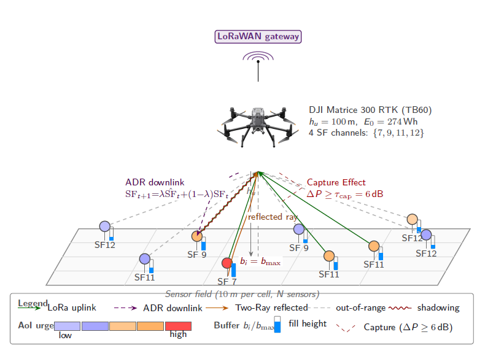

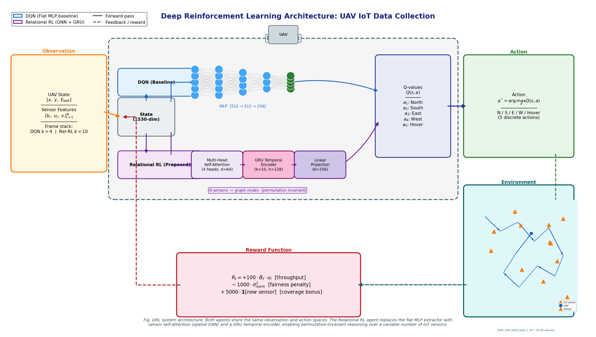

---

## Architecture Diagrams

### System Context

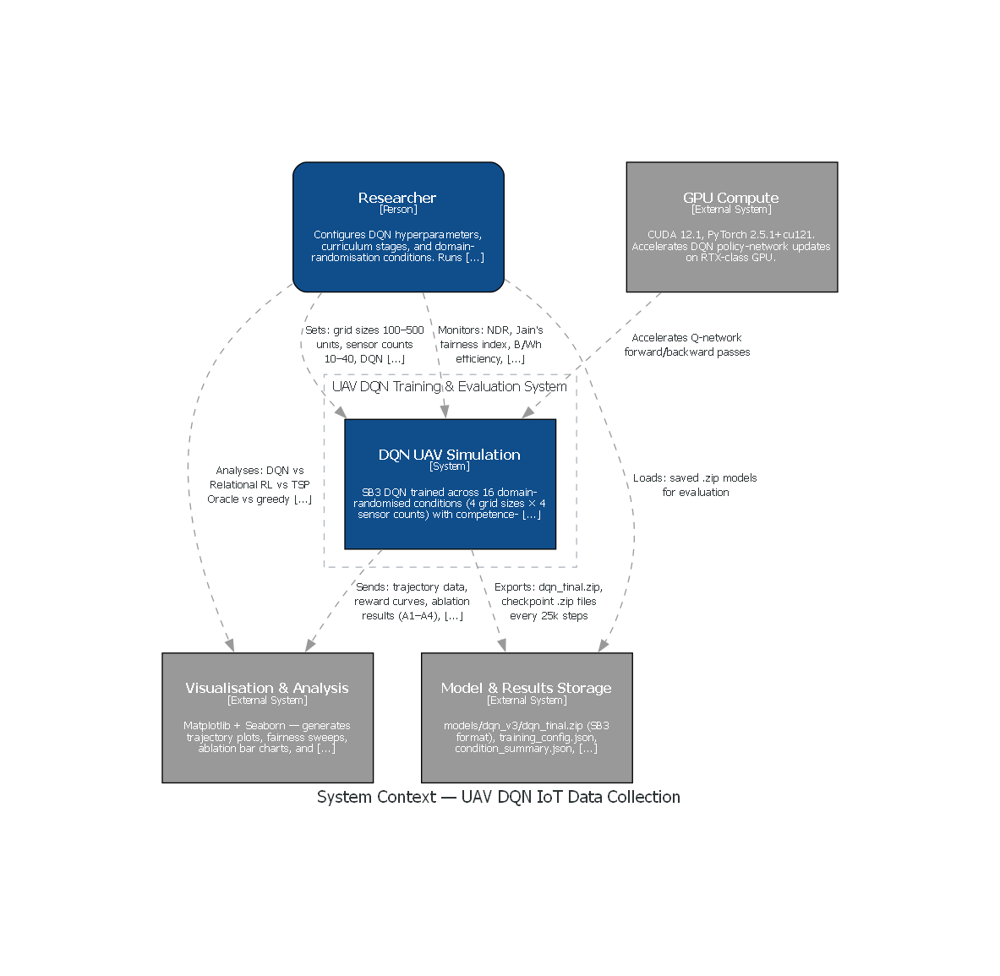

### Component Diagram

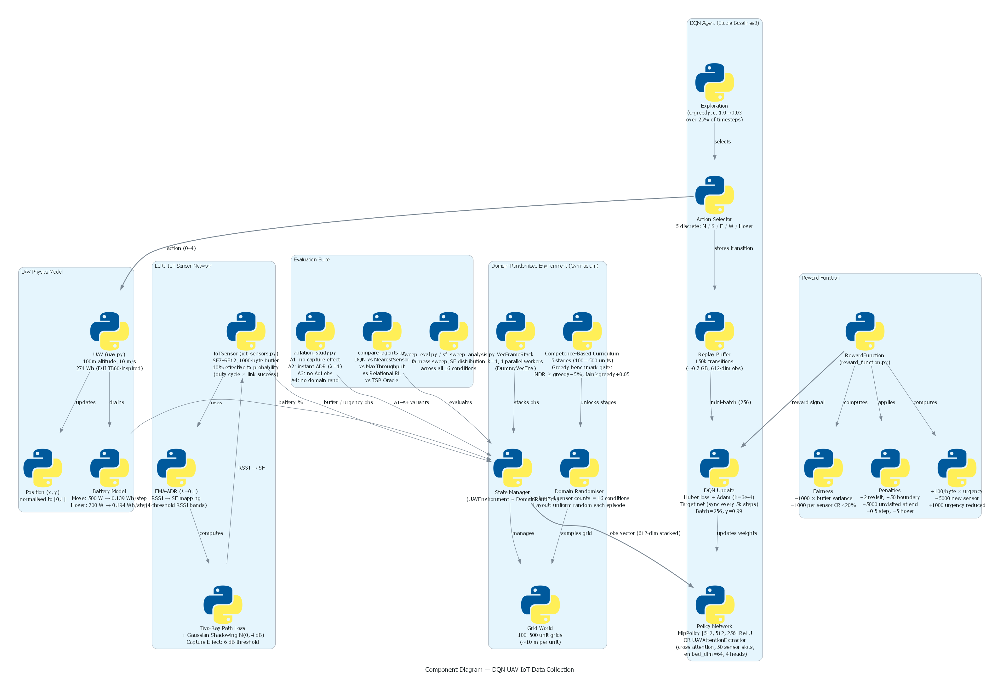

### Container Diagram

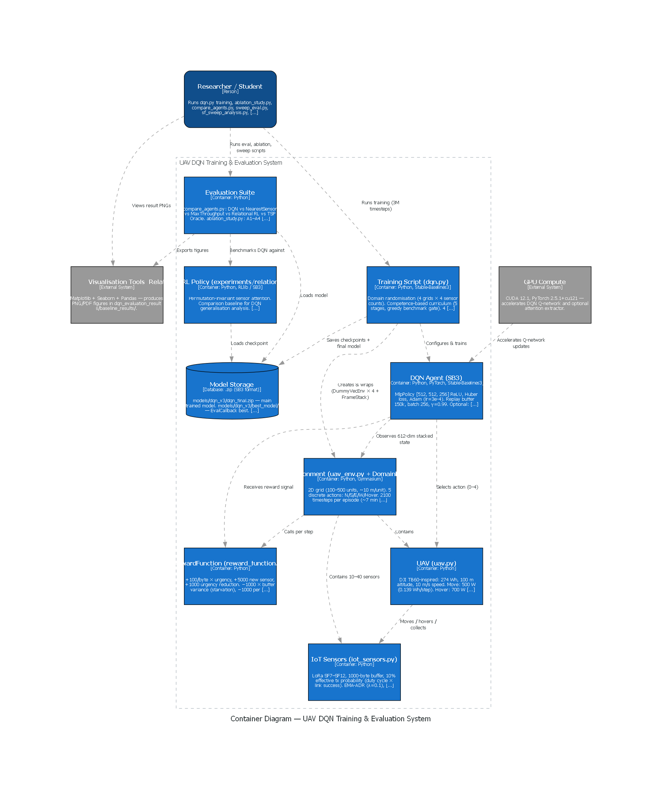

### Code / Module Diagram

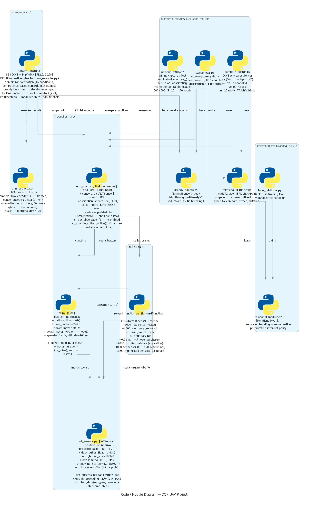

### MaxThroughputGreedyV2 Flowchart

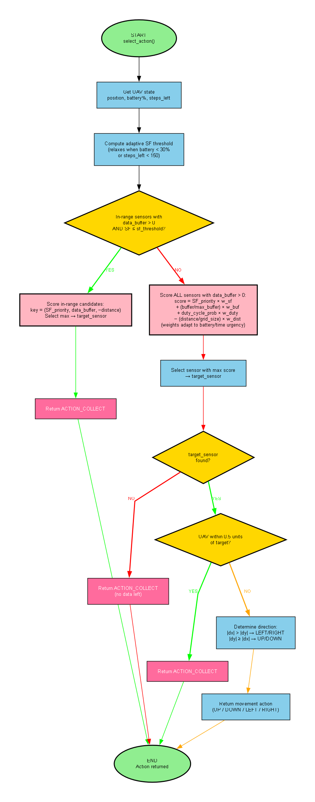

---

## Repository Structure

```
project/
├── src/
│   ├── environment/
│   │   ├── uav_env.py              # Gymnasium environment (grid, actions, rendering)
│   │   ├── iot_sensors.py          # LoRa sensor physics (path loss, ADR, buffers)
│   │   └── uav.py                  # UAV position and battery model
│   ├── rewards/
│   │   └── reward_function.py      # Multi-objective reward (data, fairness, energy)
│   ├── diagrams/
│   │   ├── environment/            # Three-dimensional Two-Ray model visualisation
│   │   ├── q_learning/             # DQN system context, component, container, code diagrams
│   │   └── greedy/                 # MaxThroughputGreedyV2 flowchart
│   └── agents/dqn/
│       ├── dqn.py                  # Main training (domain randomisation + curriculum)
│       ├── gnn_extractor.py        # UAVAttentionExtractor (cross-attention over 50 sensor slots)
│       └── dqn_evaluation_results/
│           ├── ablation_study.py           # Component ablation (A1–A4), n=20 seeds
│           ├── compare_agents.py           # DQN vs all baselines (n=20 seeds)
│           ├── sweep_eval.py               # Fairness sweep across all 16 conditions
│           ├── sf_sweep_analysis.py        # SF distribution / HHI / entropy analysis
│           ├── relational_vs_tsp_sweep.py  # Scalability benchmark
│           ├── sim_to_real_sweep.py        # Sim-to-real robustness sweep
│           ├── greedy_agents.py            # NearestSensor + MaxThroughputGreedyV2
│           ├── relational_rl_runner.py     # Loads Relational RL checkpoint for evals
│           ├── visualize_agent.py          # Single-episode trajectory visualisation
│           └── baseline_results/           # Generated PNG figures
├── models/
│   ├── dqn_v3/
│   │   ├── dqn_final.zip           # Trained DQN model (domain-randomised + curriculum)
│   │   └── best_model/             # EvalCallback best checkpoint
│   └── relational_rl/              # Relational RL checkpoints
├── asset/
│   └── diagrams/
│       ├── q_learning/             # C4 architecture diagrams (PNG)
│       └── greedy_flow_charts/     # MaxThroughputGreedyV2 flowchart (PNG)
├── MSc_and_BEng_Dissertation_Template_.../
│   └── main.tex                    # Dissertation LaTeX source
└── README.md
```

---

## Installation

### Requirements

| Requirement | Version |
|---|---|
| Python | 3.11 or higher |
| `uv` package manager | latest (recommended) |
| CUDA-capable GPU | Optional (CPU training is supported but significantly slower) |

```bash
pip install uv
```

### Setup

```bash
# Clone and install
git clone https://github.com/atiladeokegab/-Reinforcement-Learning-for-Dynamic-UAV-Energy-Efficient-Path-Planning-in-IoT-Sensor-Networks.git
cd <repo-directory>
uv sync

# Verify
uv run python -c "import stable_baselines3, gymnasium, torch; print('OK')"
```

Key dependencies: `torch==2.5.1+cu121`, `stable-baselines3`, `gymnasium`, `matplotlib`, `seaborn`, `pandas`.

---

## Running the Software

### Train the DQN Agent

```bash
uv run python src/agents/dqn/dqn.py
```

Trains for 3 million timesteps across 4 parallel enviroments using domain randomisation and a 5-stage competence-based curriculum. The trained model is saved to `models/dqn_v3/dqn_final.zip`.

Expected training time: aproximately 6–8 hours on an RTX-class GPU.

### Evaluate Against All Baselines

```bash
PYTHONIOENCODING=utf-8 uv run python src/agents/dqn/dqn_evaluation_results/compare_agents.py
```

Runs DQN, `NearestSensorGreedy`, `MaxThroughputGreedyV2`, Relational RL, TSP Oracle, and Lawnmower on the same seeded episodes (n=20 seeds). Figures saved to `dqn_evaluation_results/baseline_results/`.

### Run the Ablation Study

```bash
PYTHONIOENCODING=utf-8 uv run python src/agents/dqn/dqn_evaluation_results/ablation_study.py
```

Evaluates all four ablation variants (A1–A4) against the full model on 500×500, N=20, n=20 seeds.

### Run the SF Fairness Sweep

```bash
PYTHONIOENCODING=utf-8 uv run python src/agents/dqn/dqn_evaluation_results/sweep_eval.py
PYTHONIOENCODING=utf-8 uv run python src/agents/dqn/dqn_evaluation_results/sf_sweep_analysis.py
```

Sweeps all 16 training conditions (4 grid sizes × 4 sensor counts) and analyses SF distribution, Herfindahl–Hirschman Index, and entropy.

### Reproduce All Dissertation Figures

```bash
PYTHONIOENCODING=utf-8 uv run python src/agents/dqn/dqn_evaluation_results/compare_agents.py
PYTHONIOENCODING=utf-8 uv run python src/agents/dqn/dqn_evaluation_results/ablation_study.py
PYTHONIOENCODING=utf-8 uv run python src/agents/dqn/dqn_evaluation_results/sweep_eval.py
PYTHONIOENCODING=utf-8 uv run python src/agents/dqn/dqn_evaluation_results/relational_vs_tsp_sweep.py
```

---

## Technical Details

### Algorithm

DQN implemented via Stable-Baselines3 with an optional `UAVAttentionExtractor` (cross-attention over 50 padded sensor slots).

| Hyperparameter | Value |
|---|---|
| Policy network | MLP [512, 512, 256] ReLU |
| Optional extractor | UAVAttentionExtractor (embed_dim=64, 4 heads) |
| Optimiser | Adam (lr = 3×10⁻⁴) |
| Loss function | Huber (SmoothL1) |
| Discount factor γ | 0.99 |
| Replay buffer | 150,000 transitions |
| Batch size | 256 |
| Target network update | Every 5,000 steps |
| Exploration | ε-greedy (ε: 1.0 → 0.03 over first 25% of timesteps) |
| Frame stacking | k = 4 (VecFrameStack) |
| Parallel environments | 4 (DummyVecEnv) |
| Total timesteps | 3,000,000 |

**Domain randomisation** samples from 16 conditions (4 grid sizes × 4 sensor counts) each episode.

**5-stage competence curriculum** with greedy benchmark gates:
- Stage 0: 100×100, N=10
- Stage 1: 200×200, N=15
- Stage 2: 300×300, N=20
- Stage 3: 400×400, N=30
- Stage 4: 500×500, N=40

Promotion requires DQN NDR ≥ MaxThroughputGreedyV2 + 5% and Jain's ≥ greedy + 0.05 over a rolling 50-episode window.

### Relational RL Policy

A permutation-invariant PPO policy trained via Ray RLlib. Applies a shared per-sensor encoder, self-attention, and global pooling to produce a topology-aware representation. Checkpoints at `models/relational_rl/`. Evaluated alongside DQN by `compare_agents.py`.

### Environment Model

| Parameter | Value |
|---|---|
| Grid size | 100×100 to 500×500 cells (≈10 m/cell) |
| UAV altitude | 100 m (constant) |
| UAV speed | 10 m/s |
| UAV battery | 274 Wh (DJI TB60-inspired) |
| Power (moving) | 500 W (0.139 Wh/step) |
| Power (hovering) | 700 W (0.194 Wh/step) |
| Action space | N, S, E, W, Hover/Collect (5 discrete) |
| Episode length | 2100 timesteps (~7 min flight) |
| Sensors per episode | 10–40 |
| Spreading Factors | SF7–SF12 (EMA-ADR, λ = 0.1) |
| Buffer per sensor | 1000 bytes |
| Effective tx probability | 10% (duty cycle × link success) |
| Path loss model | Two-Ray Ground Reflection |
| Shadowing | Gaussian N(0, 4 dB) |
| Capture Effect | 6 dB threshold; closest same-SF transmitter wins |

Hover costs more power than movement. This is intentional rotary-wing aerodynamics (P_hover > P_flight).

### Reward Function

| Event | Reward |
|---|---|
| Per byte collected (× sensor urgency) | +100 |
| New sensor visited (first time) | +5,000 |
| Urgency (AoI) reduction | +1,000 |
| Revisit empty sensor | −2 |
| Boundary collision | −50 |
| Step cost | −0.5 |
| Hover surcharge | −5 |
| Buffer variance (starvation penalty) | −1,000 × variance |
| Terminal: sensor CR < 20% | −1,000 per sensor |
| Terminal: unvisited sensor | −5,000 per sensor |

---

## Results

### Training Convergence

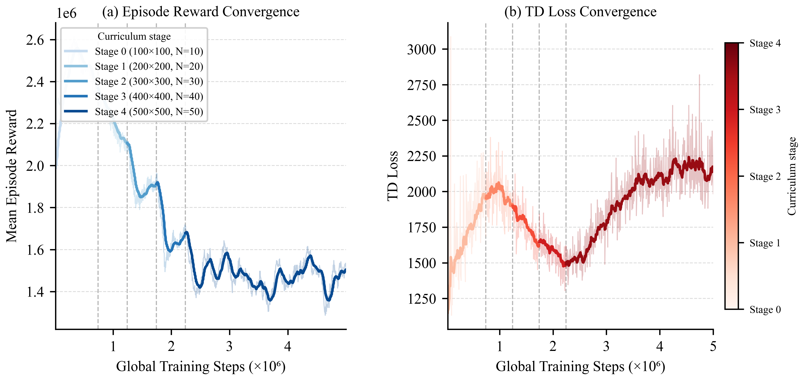

### Baseline Comparison (200×200 grid, N=50 sensors, seed=423)

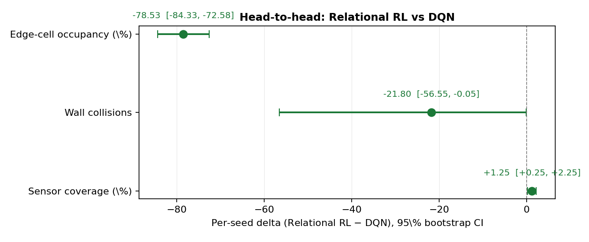

| Agent | Episode Reward | Coverage | Data Collected | Efficiency (B/Wh) | Steps |
|---|---|---|---|---|---|
| **DQN (proposed)** | 4,613,601 | 100% | 72,590 B | 270.5 | 1,381 |
| MaxThroughputGreedyV2 | 4,642,604 | 100% | 73,350 B | 273.2 | 1,381 |
| NearestSensorGreedy | 4,660,283 | 100% | 74,125 B | 276.0 | 1,381 |
| TSP Oracle (upper bound) | 5,841,667 | 100% | 73,187 B | 272.4 | 1,680 |
| Relational RL | 4,131,223 | 100% | 59,485 B | 221.5 | 1,736 |
| Lawnmower | 3,614,612 | 98% | 66,122 B | 246.1 | 1,411 |

The DQN matches greedy baseline throughput, with reward shaping that pushes toward fairer collection paterns over the episode. The TSP Oracle is a theoretical ceiling (offline optimal routing).

### Scalability

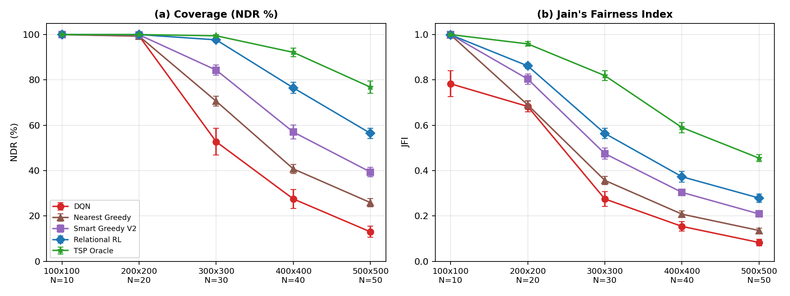

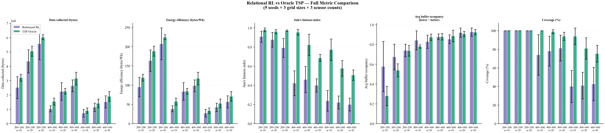

### Ablation Study (500×500, N=20, n=20 seeds)

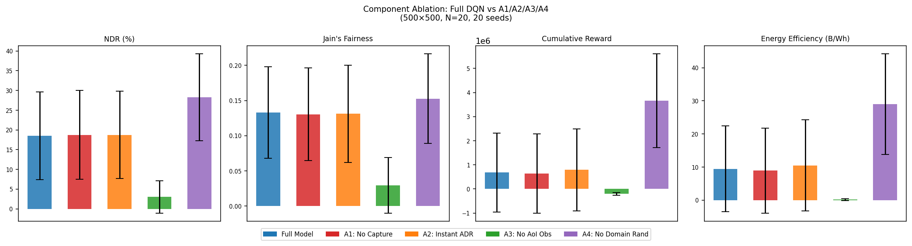

Full model vs combined ablation (Welch's t-test):

| Metric | Full Model | Ablation Mean | Cohen's d | p-value |
|---|---|---|---|---|
| Cumulative reward | 823,902 | 287,648 | 1.43 (large) | 0.000125 |
| Jain's Fairness Index | 0.288 | 0.177 | 1.23 (large) | N/A |
| Energy efficiency (B/Wh) | 51.4 | 35.8 | 0.63 (medium) | N/A |

| Ablation | Component removed |
|---|---|
| A1 | Capture Effect: all same-SF collisions → packet loss |
| A2 | EMA-ADR smoothing: λ=1.0 (instant ADR, no convergence latency) |
| A3 | AoI observation: urgency features zeroed at inference |
| A4 | Domain randomisation: fixed-env control model (500×500, N=20) |

---

## Third-Party Licences

| Library | Licence | Use |
|---|---|---|
| Stable-Baselines3 | MIT | DQN agent implementation |
| Gymnasium | MIT | Environment interface |
| PyTorch | BSD-3 | Neural network backend |
| Ray RLlib | Apache 2.0 | Relational RL training |
| Matplotlib / Seaborn | PSF / BSD | Figures |
| NumPy / Pandas | BSD | Numerical computation / data |

The custom Gymnasium environment (`uav_env.py`, `iot_sensors.py`, `uav.py`), reward function (`reward_function.py`), and all evaluation and training scripts are original work by Atilade Gabriel Oke.

---

## Known Limitations and Future Work

Known limitations:

- The flat-MLP DQN learns spatial heuristics (perimeter-adjacent flight) rather than topology-aware routing. This is an architectural consequence of the fixed-size observation encoding, not a training failure. `UAVAttentionExtractor` in `gnn_extractor.py` addresses this with cross-attention over padded sensor slots.
- The simulation assumes a flat, obstacle-free environment. Real deployments would need 3D terrain and dynamic interferance modelling.
- The Two-Ray path-loss model works in open fields but breaks down in urban LoRa deployments, which need ray-tracing or empirical channel models.
- Battery power is modelled as constant; real rotary-wing UAVs vary with payload, wind, and manoeuvring.
- The observation space is padded to 50 sensors. Performance above N=40 has not been benchmarked.

Possible extensions:

- Multi-UAV cooperative collection via QMIX or MAPPO
- Hardware-in-the-loop testing with a Raspberry Pi + LoRa HAT
- Continuous action spaces (SAC, TD3) for smoother trajectory optimisation
- 3D flight with variable altitude and dynamic sensor arrival/departure
- Higher-fidelity channel modelling via ray-tracing for better sim-to-real transfer
