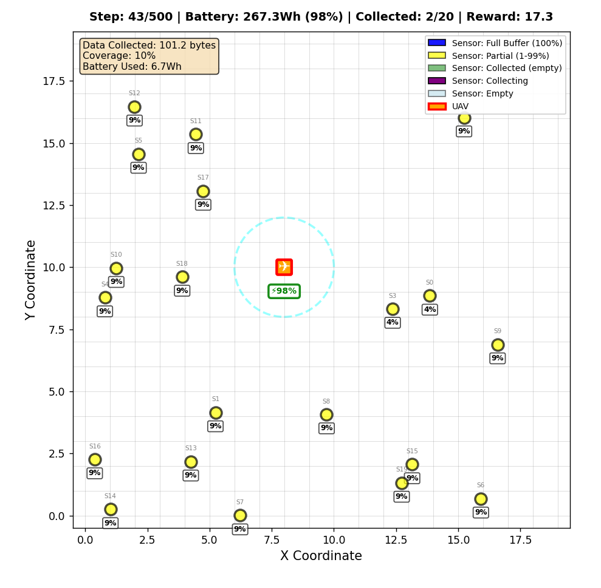
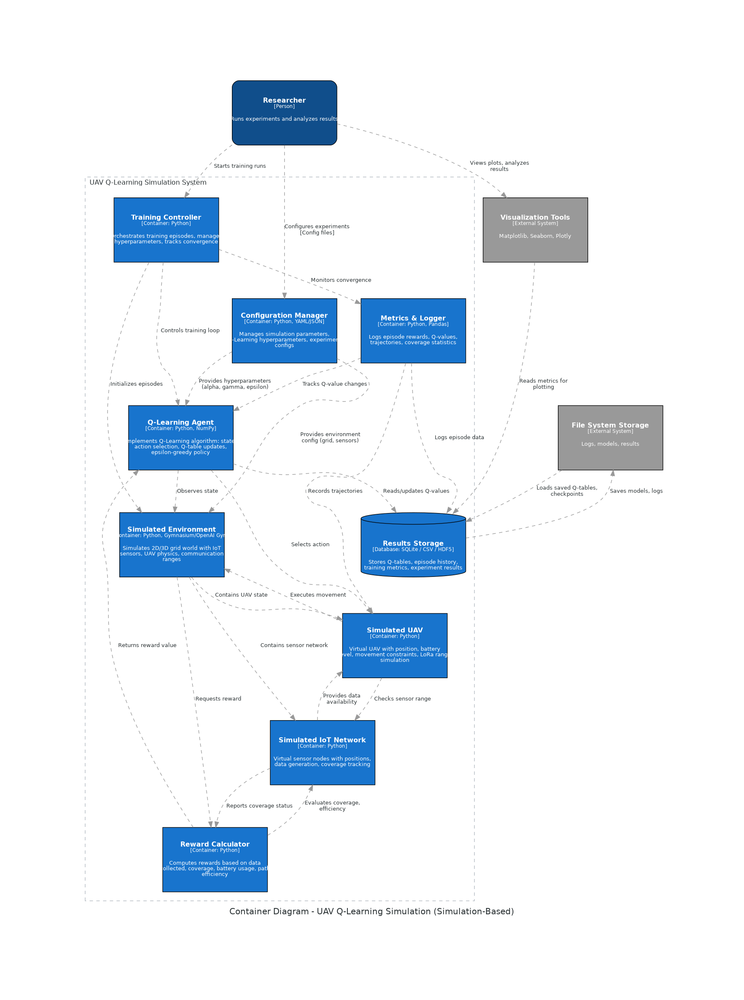
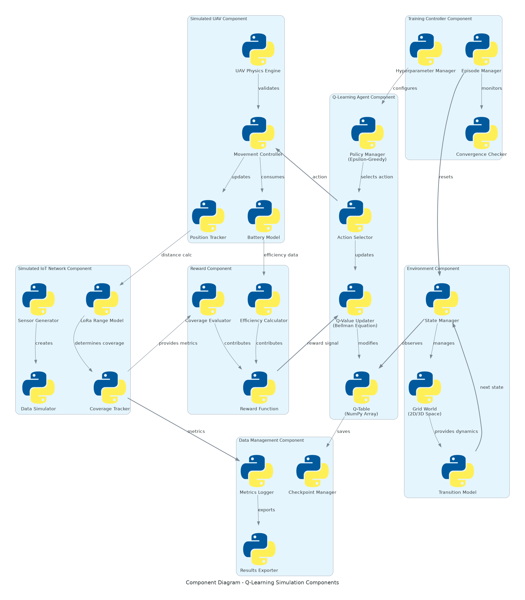
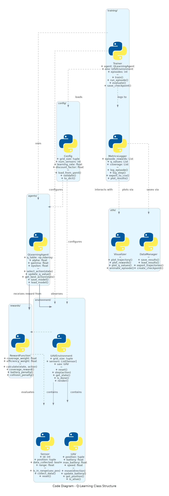

# UAV-IoT Data Collection Optimization using Reinforcement Learning

## Overview

This project focuses on **optimizing the flight trajectory of an Unmanned Aerial Vehicle (UAV)** for efficient **IoT data collection** using **Reinforcement Learning (RL)**.  
The UAV must collect data from multiple spatially distributed LoRa IoT sensors while **minimizing energy consumption**, **maximizing multi-sensor collection efficiency**, and respecting **realistic LoRa communication constraints** including duty cycle regulations.

The system models a UAV flying over an IoT network (e.g., smart agriculture, environmental monitoring, or disaster response) where it learns to balance **energy-efficient flight paths** with **opportunistic multi-sensor data collection** during brief sensor wake windows through autonomous decision-making.

---
## Demo Video of Environment
[

## Problem formulation
[

## Key Features

### Advanced LoRa Communication Modeling
- **✅Spreading Factor (SF) Orthogonality**: Supports concurrent data collection from up to 6 sensors simultaneously (SF7-SF12)
- **✅Realistic Path Loss**: Two-Ray Ground Reflection model with configurable path loss exponents
- **✅Adaptive Data Rate (ADR)**: Dynamic spreading factor selection based on RSSI and distance
- **✅Probabilistic Transmission**: Success probability calculated as P_success = P_link × P_cycle
- **✅Capture Effect**: Collision resolution where closest sensor wins per spreading factor

### Energy-Aware System Design
- **✅UAV Battery Constraints**: Realistic battery drain for movement and hovering
- **✅Sensor Duty Cycles**: EU-compliant 1% duty cycle support (configurable 1-100%)
- **✅Energy-Efficient Rewards**: Multi-objective optimization balancing collection vs. energy usage

### Multi-Sensor Collection Strategy
- **✅Simultaneous Collection**: UAV can collect from multiple sensors in a single COLLECT action
- **✅SF-Based Concurrency**: Different spreading factors enable parallel transmissions
- **✅Asynchronous Sensors**: Randomized duty cycle positions prevent synchronization artifacts
- **✅Strategic Positioning**: Agent learns to position for maximum multi-sensor collection opportunities

###  Enhanced Visualization
- **✅Real-Time Environment Rendering**: Live 2D grid visualization with sensor states
- **✅Duty Cycle Indicators**: Green/red rings showing active/sleeping sensors
- **✅Active Collection Display**: Purple dashed lines with SF labels for ongoing transmissions
- **✅Communication Range Visualization**: Dotted lines showing sensors in range
- **✅Performance Metrics Panel**: Real-time stats on battery, coverage, and data collected

---

## Objectives

1. ✅ Develop a simulation environment modeling UAV movement and LoRa-based IoT communication  
2. ✅ Implement realistic LoRa physics including SF orthogonality, duty cycles, and path loss  
3. ✅ Enable multi-sensor concurrent collection with collision resolution  
4. ✅ Formulate the UAV data collection problem as a **Markov Decision Process (MDP)**  
5. Implement and compare **Q-Learning** (value-based) and **Proximal Policy Optimization (PPO)** (policy-based)  
6. Design reward functions balancing **energy consumption**, **data collection**, and **multi-sensor efficiency**  
7. Analyze trained UAV policies and demonstrate learned path planning behavior

---

## Problem Statement

This dissertation addresses the problem of energy-efficient, dynamic path planning for Unmanned Aerial Vehicles UAVs 
tasked with data collection in dense, unsynchronized LoRaWAN IoT networks. We identify that standard path planning heuristics are suboptimal,
as they fail to account for the LoRa protocol's physics, leading to a Spreading Factor SF monoculture" bottleneck that wastes concurrent channel capacity.

### Key Challenges
- **Duty Cycle Constraints**: IoT sensors are only active 1-10% of the time; UAV must learn sensor wake patterns
- **Multi-Sensor Coordination**: Optimize positioning to collect from multiple sensors simultaneously
- **SF Collision Management**: Handle concurrent transmissions on the same spreading factor
- **Energy-Data Tradeoff**: Balance hovering time for collection vs. movement for coverage
- **Asynchronous Sensors**: Each sensor operates on independent duty cycle timing

### Constraints
- UAV must collect data from all sensors while respecting battery limits
- Data transfer occurs only when:
  - UAV is within effective LoRa range (RSSI > threshold)
  - Sensor is active in its duty cycle window
  - Probabilistic transmission success (based on link quality)
- Up to 6 concurrent collections per action (one per SF7-SF12)
- Collision resolution via capture effect (closest sensor wins)

---

## System Design

### Environment
- 2D discrete grid representing UAV operating area.
- Each IoT node occupies a fixed grid position.
- UAV state includes:
  - Current position  
  - AoI of each node  
  - Remaining energy  

### Action Space
- `{North, South, East, West, Hover}`

### Reward Function
A weighted combination of:
- Energy usage penalty  
- Data collection gain  
- Visiting new nodes reward  
- Hovering penalty  
- AoI penalty  

### Algorithms
- **Phase 1:** 4 types of Greedy (Baseline)  
- **Phase 2:** DQN (Deep RL)  

---

## Reinforcement Learning Workflow

1. ✅Initialize UAV and IoT environment  
2. ✅Choose and execute an action  
3. ✅Receive reward based on energy, AoI, and data freshness  
4. ✅Update policy or Q-table  
5. Repeat until convergence  
6. Evaluate trained policy performance  

---

## Technical Stack

| Component | Technology                                                                              |
|------------|-----------------------------------------------------------------------------------------|
| **Language** | Python 3.11 ($\text{better support for torch}$)                                         |
| **RL Libraries** | Stable-Baselines3 (PPO, DQN, A2C), Gymnasium                                            |
| **Simulation** | Custom UAV Environment (OpenAI Gym Compatible)                                          |
| **Visualization** | Matplotlib, Seaborn                                                                     |
| **Backend/Compute** | WSL2 (Ubuntu) with NVIDI A RTX 3050 Ti switched back to Windows got stuck in linux hell |
| **Report Writing** | LaTeX / Overleaf                                                                        |

---

## Key Performance Metrics

| Metric | Description |
|--------|-------------|
| **Average AoI** | Mean Age of Information across all nodes |
| **Energy Consumption** | Total simulated UAV energy use |
| **Trajectory Efficiency** | Distance per AoI improvement |
| **Reward Convergence** | Stability and magnitude of cumulative rewards |
| **Learning Comparison** | PPO vs Q-Learning performance |

---

## Project Milestones

| Phase | Timeline | Goal |
|--------|-----------|------|
| Environment Setup | Oct 2025 | Create 2D UAV-IoT simulation |
| Q-Learning Implementation | Nov 2025 | Baseline model training |
| PPO Implementation | Dec 2025 – Jan 2026 | Policy-based deep RL model |
| Evaluation & Visualization | Feb – Mar 2026 | Compare algorithms and tune rewards |
| Final Report & Presentation | Apr – May 2026 | Submit final report and demo |

---
### Path Loss Formula

The path loss is given by:

$$
PL(d) = 10 \, n \, \log_{10}\left(\frac{d}{d_0}\right)
$$

#### Relationship Between RSS and Path Loss

The received signal strength (RSS) is related to the transmitted power and path loss as:

$$
RSS(d) = P_t - PL(d)
$$

Where:
- $RSS(d)$: Received signal strength at distance $d$ (in dBm)
- $P_t$: Transmit power (in dBm)
- $PL(d)$: Path loss at distance $d$ (in dB)

#### Addition of Gaussian random variable
Since we cannot model all the trees and objects which will be interfering with signal we introduce a disturbance of 4 db
but a zero mean gaussian random variable

where y = random disturbance between the -4bd to +4db
$$
RSSI = RSS(d) + y
$$
---

#### Example Spreading Factor Calibration For A 50m By 50m Environment
```
    RSSI_SF_MAPPING = [
        (-39, 7),            # SF7: RSSI > -39 dBm (very close, 0-1m)
        (-44, 9),            # SF9: RSSI > -44 dBm (close, 1-2m)
        (-50, 11),           # SF11: RSSI > -51 dBm (medium, 2-10m)
        (-100, 12)  # SF12: RSSI < -51 dBm (far, 10-70m)
    ]

```
---

### LoRa Data Rates
for the modeling of Lora we apperciate that the ADR does not change immediately, so we take the average RSSI over N steps

| Spreading Factor | Data Rate (bytes/sec) | Characteristics |
|---|---|---|
| 7 | ~684 | Highest speed, shortest range |
| 8 | ~390 | — |
| 9 | ~220 | — |
| 10 | ~122 | — |
| 11 | ~55 | — |
| 12 | ~31 | Maximum range, lowest speed |

---

## Demo Video of Environment
[](https://youtu.be/QgQFRd8uP28)
## Environment diagram

## C4 Architecture Diagrams

### 1. System Context Diagram


### 2. Container Diagram


### 3. Component Diagram
)

### 4. Code Diagram



