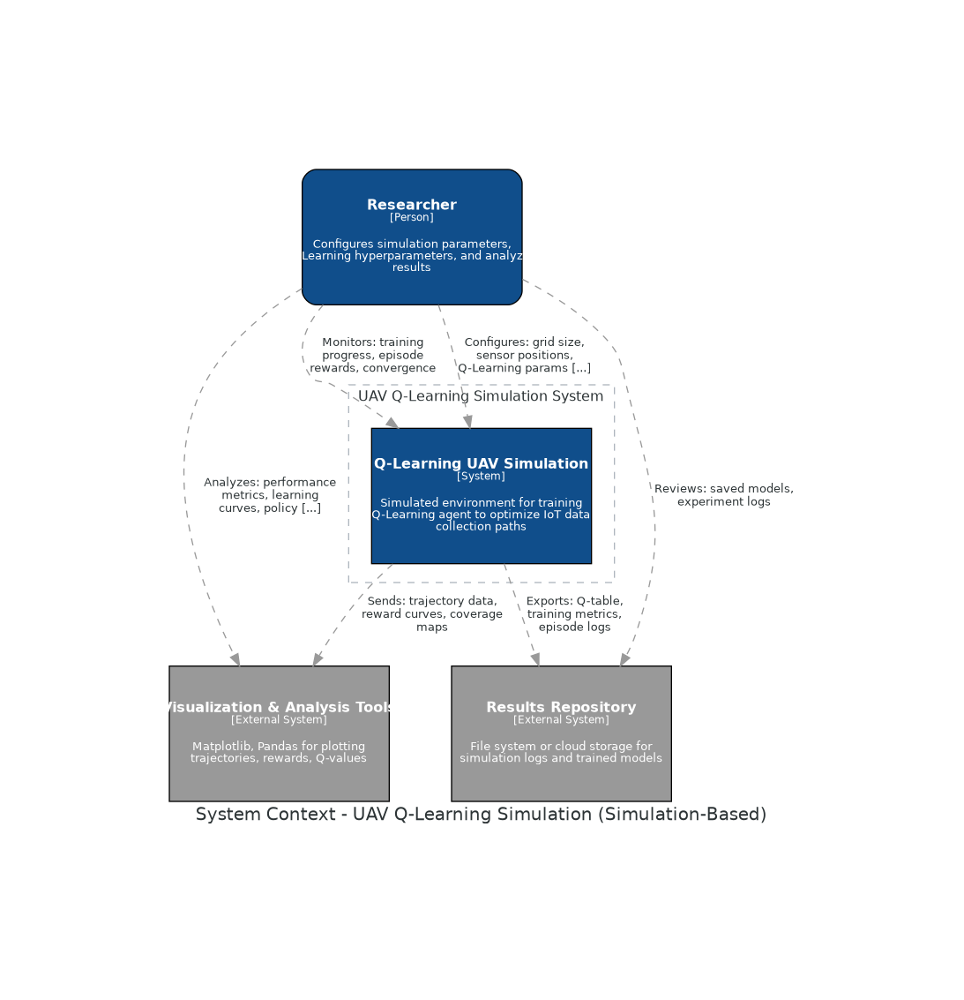

# UAV-IoT Data Collection Optimization using Reinforcement Learning

## Overview

This project focuses on **optimizing the flight trajectory of an Unmanned Aerial Vehicle (UAV)** for efficient **IoT data collection** using **Reinforcement Learning (RL)**.  
The UAV must collect data from multiple spatially distributed IoT sensors while **minimizing energy consumption** and **maximizing data freshness**, measured via **Age of Information (AoI)**.

The system models a UAV flying over an IoT network (e.g., smart agriculture, environmental monitoring, or disaster response) where it learns to balance **energy-efficient flight paths** with **timely data collection** through autonomous decision-making.

---

## Objectives

1. Develop a simulation environment modeling UAV movement and LoRa-based IoT communication.  
2. Formulate the UAV data collection problem as a **Markov Decision Process (MDP)**.  
3. Implement and compare **Q-Learning** (value-based) and **Proximal Policy Optimization (PPO)** (policy-based) algorithms.  
4. Design reward functions balancing **energy consumption**, **AoI**, and **data collection**.  
5. Analyze the performance of trained UAV policies in terms of energy, AoI, and trajectory efficiency.  
6. Demonstrate the UAV’s learned path planning behavior using trajectory visualizations.

---

## Problem Statement

The goal is to optimize the path of a single UAV for IoT data collection in a network of spatially distributed sensors while minimizing energy consumption and ensuring timely updates of sensor data.

### Constraints
- The UAV must visit each IoT node at least once per mission.
- Data transfer occurs only when the UAV is within the **effective LoRa range**.
- UAV energy and hovering time are limited.
- IoT nodes continuously generate new data; UAV must balance waiting vs. traveling to reduce AoI.

---

## System Design

### Environment
- 2D discrete grid representing UAV operating area.
- Each IoT node occupies a fixed grid position.
- UAV state includes:
  - Current position  
  - AoI of each node  
  - Remaining energy  

### Action Space
- `{North, South, East, West, Hover}`

### Reward Function
A weighted combination of:
- Energy usage penalty  
- Data collection gain  
- Visiting new nodes reward  
- Hovering penalty  
- AoI penalty  

### Algorithms
- **Phase 1:** Q-Learning (Baseline)  
- **Phase 2:** PPO (Policy-Based, Deep RL)  

---

## Reinforcement Learning Workflow

1. Initialize UAV and IoT environment  
2. Choose and execute an action  
3. Receive reward based on energy, AoI, and data freshness  
4. Update policy or Q-table  
5. Repeat until convergence  
6. Evaluate trained policy performance  

---

## Technical Stack

| Component | Technology                                     |
|------------|------------------------------------------------|
| **Language** | Python 3.13                                    |
| **RL Libraries** | Stable-Baselines3 (PPO, DQN, A2C), Gymnasium   |
| **Simulation** | Custom UAV Environment (OpenAI Gym Compatible) |
| **Visualization** | Matplotlib, Seaborn                            |
| **Backend/Compute** | WSL2 (Ubuntu) with NVIDIA RTX 3050 Ti          |
| **Report Writing** | LaTeX / Overleaf                               |

---

## Key Performance Metrics

| Metric | Description |
|--------|-------------|
| **Average AoI** | Mean Age of Information across all nodes |
| **Energy Consumption** | Total simulated UAV energy use |
| **Trajectory Efficiency** | Distance per AoI improvement |
| **Reward Convergence** | Stability and magnitude of cumulative rewards |
| **Learning Comparison** | PPO vs Q-Learning performance |

---

## Project Milestones

| Phase | Timeline | Goal |
|--------|-----------|------|
| Environment Setup | Oct 2025 | Create 2D UAV-IoT simulation |
| Q-Learning Implementation | Nov 2025 | Baseline model training |
| PPO Implementation | Dec 2025 – Jan 2026 | Policy-based deep RL model |
| Evaluation & Visualization | Feb – Mar 2026 | Compare algorithms and tune rewards |
| Final Report & Presentation | Apr – May 2026 | Submit final report and demo |

---
### Run on linux
```bash
sudo apt-get update
sudo apt-get install graphviz
```
## Environment diagram

## C4 Architecture Diagrams

### 1. System Context Diagram


### 2. Container Diagram


### 3. Component Diagram
)

### 4. Code Diagram


